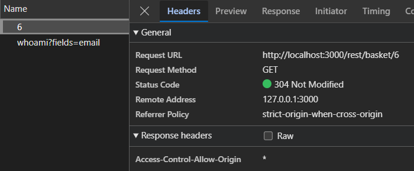
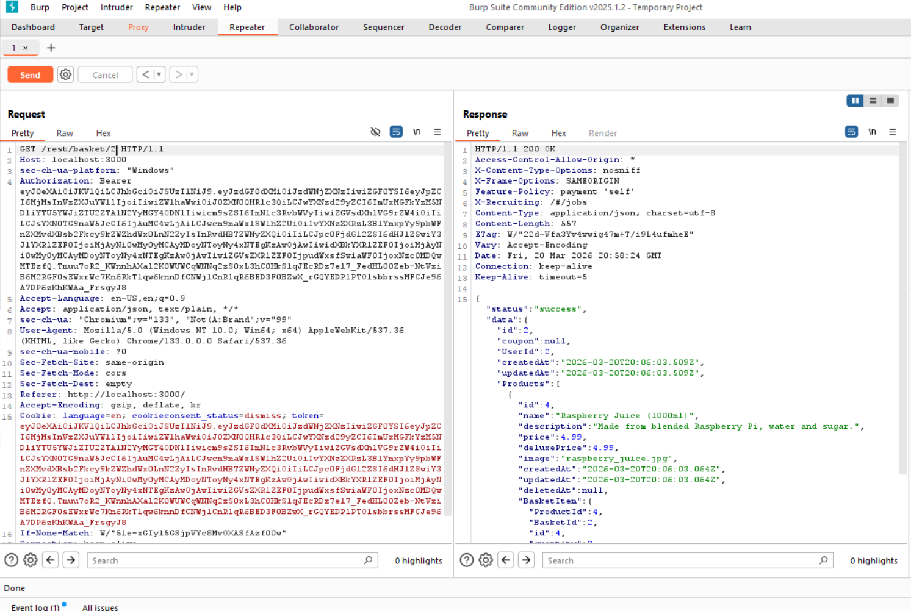
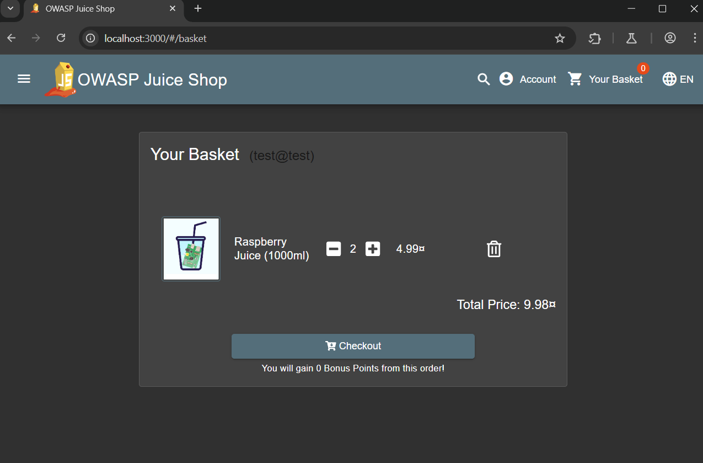

# Broken Access Control / IDOR – Basket Access

## Description
While navigating **OWASP Juice Shop** with a regular user account and monitoring traffic in Burp Suite, I identified a **Broken Access Control** issue affecting shopping basket access. By modifying the basket identifier in a request, it was possible to access another user's basket.

This is a classic **Insecure Direct Object Reference (IDOR)** scenario, where the application exposes an object identifier without enforcing proper ownership checks at the server level.

---

## 🔍 Discovery Process
After creating an account and browsing the application manually, I observed requests related to basket operations. The presence of a numeric `id` in the URL/body suggested that basket resources were referenced directly.

> [!NOTE]
> During this process, I also noticed a potential **sensitive data exposure** issue, which will be documented as a separate finding.


---

## Exploitation

### 1. Intercepted Request
A request to retrieve basket contents was captured in **Burp Suite Proxy**. The request targeted a specific endpoint with a basket ID parameter.

### 2. Manipulation
The basket `id` value was changed from the assigned ID to a different numeric identifier (e.g., changing `1` to `2`).

### 3. Result
The server responded with the JSON data of another user's shopping basket instead of returning a `403 Forbidden` error. This confirmed that the application trusts the client-supplied ID without verifying session ownership.

---

## Proof of Concept

### Example Attack Flow
1. **Login:** Authenticate with a standard user account.
2. **Intercept:** Capture the `/rest/basket/X` request in Burp Suite.
3. **Modify:** Change the `X` value to another integer.
4. **Forward:** Send the manipulated request to the server.
5. **Observe:** The response contains items currently in a different user's basket.

#### Screenshot


*Left: Intercepting and modifying the basket ID in Burp Suite.*

*Right: Unauthorized server response containing third-party basket data.*


*Figure: Forwarded basket request interface.*

---

## Root Cause (Code Analysis)

The vulnerability is caused by missing server-side authorization checks. The application trusts the object identifier provided by the client and returns the resource without validating permissions.

### Vulnerable Pattern (Insecure)
The application simply fetches and returns the object based on the URL parameter without checking who is asking.

```javascript
// Insecure: No ownership check
const basket = getBasketById(req.params.id);
return res.json(basket);
```

### Recommended Fix (Validation)
Add a server-side check to ensure the userId associated with the basket matches the id of the currently authenticated user.

```javascript
const basket = getBasketById(req.params.id);

// Check if basket exists AND belongs to the authenticated user
if (!basket || basket.userId !== req.user.id) {
  return res.status(403).json({ error: 'Forbidden' });
}

return res.json(basket);
```

### Best Practice (Scoped Query)
The most secure method is to scope the database query so it is logically impossible to retrieve another user's data, regardless of the ID provided in the request.

```javascript
// Best Practice: The query itself enforces authorization
const basket = getBasketByIdAndUserId(req.params.id, req.user.id);

if (!basket) {
  // Returning 404 to prevent ID enumeration
  return res.status(404).json({ error: 'Resource not found' });
}

return res.json(basket);
```

## Key Takeaway
This finding highlights a fundamental AppSec principle: Authentication ≠ Authorization. Being logged in (Authentication) is only the first step; the application must verify permissions (Authorization) before returning any protected resource.
