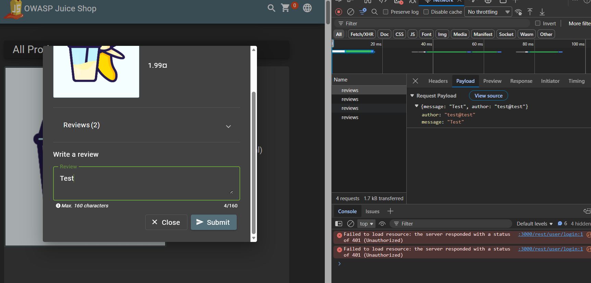
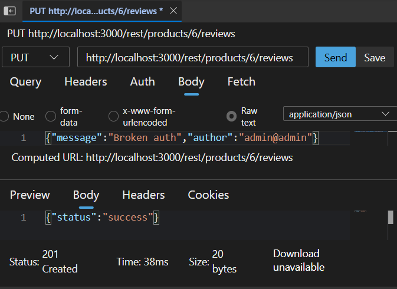
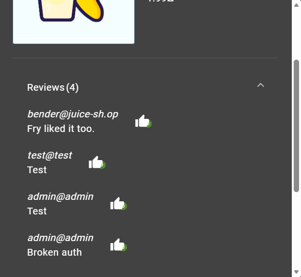
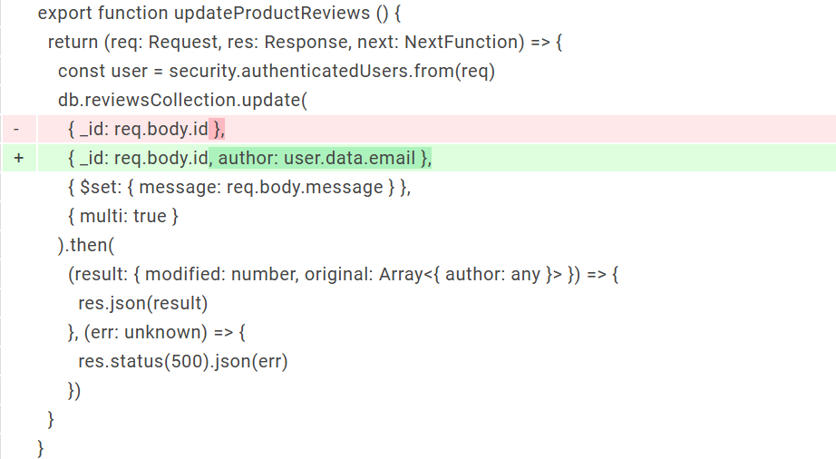

# Broken Access Control – Review Author Impersonation

## 📝 Description
While analyzing the product review functionality in **OWASP Juice Shop**, I identified a **Broken Access Control** vulnerability. The application requires a user to pass an `author` identifier in the request body when submitting a review. By manipulating this attribute within the browser's Developer Tools, I confirmed that the backend does not validate this identifier against the active session, allowing any authenticated user to impersonate another user and post reviews under their name.

---

## 🔍 Discovery Process
I navigated to a product page and submitted a legitimate review. Using the **Network Tab** in the browser's Developer Tools, I monitored the outgoing traffic. I located the `POST` request responsible for submitting the review (e.g., `/rest/products/6/reviews`).

I analyzed the JSON payload and immediately noted that the `author` field was populated with my account's email address. This strongly suggested that the server was blindly trusting the client to identify the author rather than deriving it securely from the authentication token (JWT).

#### Screenshots
  

*Figure 1: Initial discovery in DevTools Network tab, showing the client-supplied author field in the request body.*

---

## ⚡ Exploitation

### 1. Intercepted Request
Using the discovery information, I initiated a new review submission. The base request body was captured:
* **Target Endpoint:** `/rest/products/6/Reviews`
* **Original Body:** `{"message": "Test", "author": "test@test"}`

### 2. Manipulation (Identity Theft)
Instead of using an external tool like Burp Suite, I utilized the built-in **"Edit and Resend"** feature within the DevTools Network tab. I modified the `author` field from my email (`test@test`) to another email
* **Manipulated Body:** `{"message": "Broken auth", "author": "admin@admin"}`

### 3. Result
The server responded with a `201 Created` status, indicating success. This confirmed that the backend performed no server-side validation to ensure the `author` matched the identity in the active JWT session token.

#### Screenshots
  
*Figure 2: Using the 'Edit and Resend' feature in DevTools to modify the author payload.*

---

## 🖼️ Proof of Concept (Verification)

### Verification Step
To verify the successful exploitation, I refreshed the product page. The review I had just submitted appeared publicly on the storefront, but it was attributed to **`admin@admin`**. This demonstrates that I had successfully impersonated the Administrator without needing their credentials.

#### Screenshots
  
*Figure 3: The review interface showing the fraudulent review successfully posted under the Administrator's account.*

---

## 💻 Root Cause & Remediation

The vulnerability is a direct result of trusting the request body for authentication/identity information. The source code analysis below illustrates this flaw and the subsequent fix.

### ❌ Vulnerable Code
```js
db.reviewsCollection.update(
  { _id: req.body.id },
  { $set: { message: req.body.message } },
  { multi: true }
)
```


The query only filters by review ID, allowing any authenticated user to modify any review.

✅ Secure Fix
```js
db.reviewsCollection.update(
  { _id: req.body.id, author: user.data.email },
  { $set: { message: req.body.message } },
  { multi: true }
)
```

Explanation:

The fix enforces ownership validation by ensuring that the review being modified belongs to the authenticated user.

The user identity is extracted from the request:
```js
const user = security.authenticatedUsers.from(req)
```

This prevents attackers from modifying other users' reviews, even if they tamper with the review ID.

  


---

## 🛡️ Impact & Takeaway

### Impact
* **Account Impersonation:** High. An attacker can damage reputations or post malicious content appearing to be from staff or other users.
* **Data Integrity:** The application’s review system is no longer trustworthy, as the data does not reflect genuine user activity.
* **Compliance:** Failure of standard access control controls (NIST, OWASP ASVS).

### Key Takeaway
**Authentication ≠ Authorization.** Even if a user is logged in (Authentication), the application must verify that they have the required permissions for the *specific action* they are taking. Any attempt by the client to explicitly state its own identity or permissions must be ignored by the server in favor of secure, session-based alternatives.
