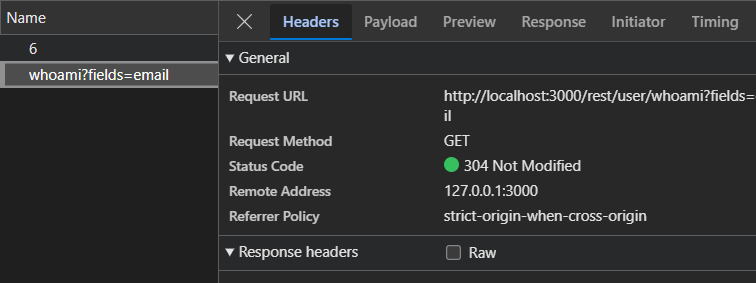
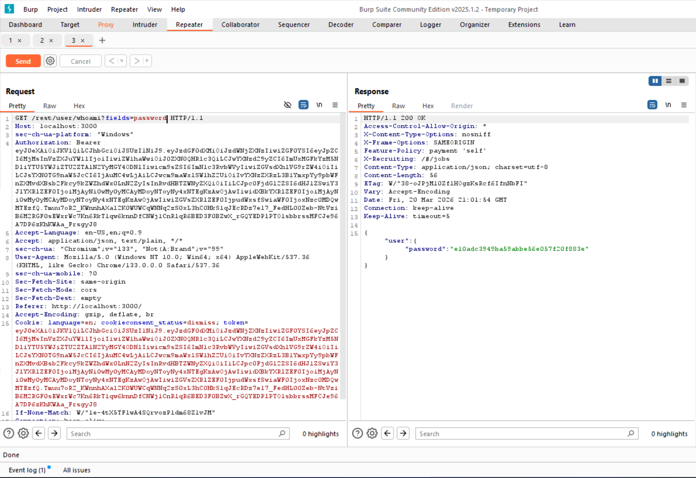
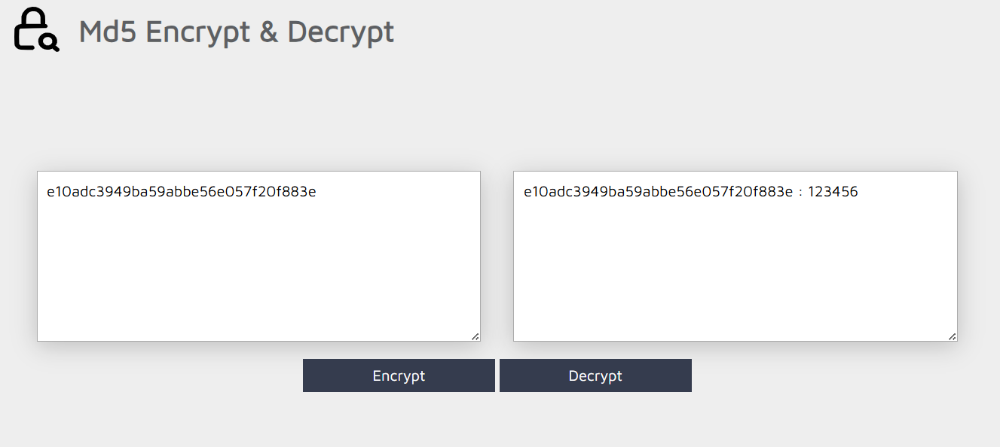

# Sensitive Data Exposure – Attribute Injection & Weak Hashing

## Description
While testing the **OWASP Juice Shop**, I identified a **Sensitive Data Exposure** vulnerability on the `/rest/user/whoami` endpoint. The application's backend is designed to accept a dynamic `fields` query parameter to filter JSON responses. I discovered that the server-side logic fails to validate these fields against a whitelist, allowing an attacker to exfiltrate internal database columns, including hashed passwords.

Furthermore, the application uses **MD5** for password storage, which is a legacy algorithm that offers no protection against modern cracking tools.
---

## 🔍 Discovery Process
I monitored the **XHR/Fetch** traffic in the browser's Developer Tools while navigating to the Basket page. 
  

I noticed that the Angular `UserService` calls `/rest/user/whoami?fields=email`. By testing this endpoint in **Burp Suite**, I confirmed that the `fields` parameter could be manipulated to include sensitive internal attributes that are not meant for the frontend.

---

## Exploitation

### 1. Intercepted Request
I captured the request generated by the Angular application:
`GET /rest/user/whoami?fields=email HTTP/1.1`

### 2. Manipulation (Attribute Injection)
Using **Burp Repeater**, I modified the query parameter to request the password field specifically.
* **Legitimate:** `/rest/user/whoami?fields=email`
* **Manipulated:** `/rest/user/whoami?fields=password`

### 3. Result
The server returned a JSON object containing the `password` field. The value was an **MD5 hash** (`e10adc3949ba59abbe56e057f20f883e`). This reveals that the backend's data-access layer (DAL) is directly influenced by client-side parameters without server-side validation.

---

## Proof of Concept

### Example Attack Flow
1. **Login:** Authenticate to the Juice Shop.
2. **Observe:** The Angular app displays "user@example.com" in the basket.
3. **Intercept:** Find the `/whoami` call in Burp Suite Proxy history.
4. **Modify:** Append `?fields=password` and send.
5. **Analyze:** Extract the MD5 hash from the response body.

#### Screenshots
  
*Figure 1: The server returned a JSON object containing the `password` field.*

  
*Figure 2: the passwords are stored using the MD5 hashing algorithm.*

---

## 💻 Root Cause & Remediation

The vulnerability stems from the backend passing the raw Sequelize `User` model to `res.json()`, allowing the client to dictate the query projection.

### ❌ Vulnerable Pattern (Express/Sequelize)
The backend uses the client-provided string directly in the attributes array:
```javascript
// Insecure Node.js implementation
exports.whoAmI = (req, res) => {
  const fields = req.query.fields ? req.query.fields.split(',') : ['email'];
  
  models.User.findByPk(req.user.id, { attributes: fields })
    .then(user => {
      res.json({ user }); // Sends whatever columns were requested
    });
};
```

### Recommended Fix
The fix requires implementing a strict server-side whitelist. The backend should never trust the fields parameter. Instead, it should compare the requested fields against a hardcoded list of "safe" attributes. Any request for a sensitive field must be rejected.

Additionally, the application must upgrade its hashing algorithm. MD5 is fundamentally broken. Passwords should be hashed using Argon2id or bcrypt with a unique salt per user to prevent rainbow table attacks.

### Key Takeaway
Data exposure is twice as dangerous when the data itself is poorly protected. While the primary fix is to stop the API from leaking the password field, the secondary fix (modern hashing) ensures that even if a database leak occurs, the credentials remain secure.
