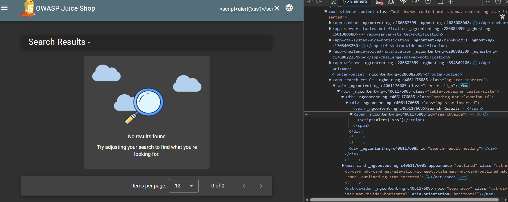
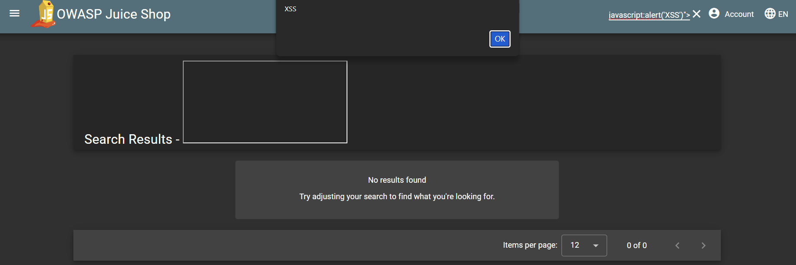
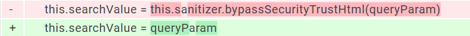

# DOM-Based Cross-Site Scripting (XSS) – Search Function

## 📝 Description
The search functionality in **OWASP Juice Shop** is vulnerable to **DOM-based Cross-Site Scripting (XSS)**. User input from the query parameter is inserted into the DOM without proper sanitization, allowing execution of arbitrary JavaScript.

This demonstrates how misuse of framework security features can introduce critical vulnerabilities.

---

## ⚡ Exploitation

### Initial Attempt
**Payload:**
`<script>alert('XSS')</script>`

* **Result:** Did not execute in the browser.
* **Observation:** Inspection via DevTools showed that the payload still existed in the DOM (search value) but was not executed.



### Successful Payload
**Payload:**
`<iframe src="javascript:alert('XSS')">`

* **Result:** Executed successfully, confirming a DOM-based XSS vulnerability.



---

## 🔍 Root Cause (Code Analysis)

The following function was identified in the source code:

```typescript
filterTable () {
    let queryParam: string = this.route.snapshot.queryParams.q
    if (queryParam) {
      queryParam = queryParam.trim()
      this.dataSource.filter = queryParam.toLowerCase()
      
      // The Vulnerable Line
      this.searchValue = this.sanitizer.bypassSecurityTrustHtml(queryParam)
      
      this.gridDataSource.subscribe((result: any) => {
        if (result.length === 0) {
          this.emptyState = true
        } else {
          this.emptyState = false
        }
      })
    } else {
      this.dataSource.filter = ''
      this.searchValue = undefined
      this.emptyState = false
    }
}
```
Explanation
The Sanitizer: The application uses Angular’s DomSanitizer.

The Flaw: The method bypassSecurityTrustHtml() explicitly disables Angular’s built-in sanitization, trusting user input as safe HTML.

The Result: This allows injection of malicious HTML/JS into the DOM.

🛠️ Fix

❌ Vulnerable Code

this.searchValue = this.sanitizer.bypassSecurityTrustHtml(queryParam)

✅ Secure Fix

this.searchValue = queryParam



Note: Angular automatically sanitizes the input when assigning directly. Avoid using bypassSecurityTrustHtml unless absolutely necessary.

## 🛡️ Impact & Takeaway
Impact
Attackers can execute arbitrary JavaScript in a victim’s browser, leading to:

Session Hijacking: Stealing session cookies.

Credential Theft: Phishing via fake forms.

Malicious DOM Manipulation: Altering site content.

## Key Takeaway
This vulnerability highlights the danger of overriding framework security features. Proper use of Angular’s built-in sanitization prevents XSS without removing security mechanisms.
